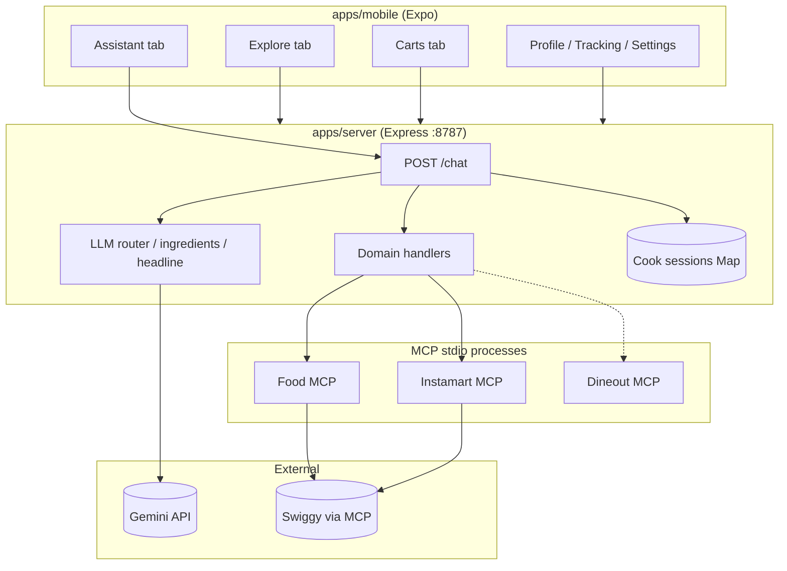
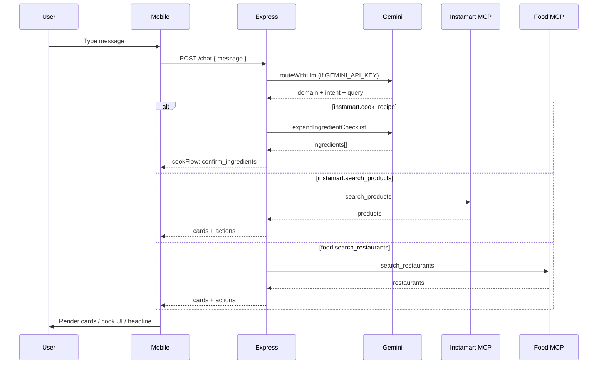
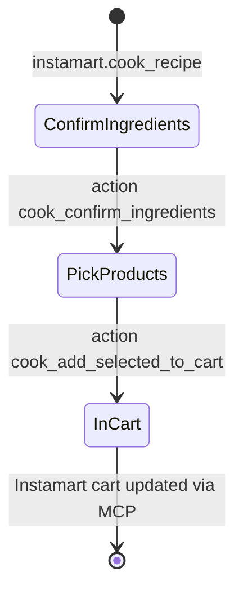

# Swiggy Personal Assistant

A personal Swiggy assistant that unifies **Food delivery**, **Instamart groceries**, and **Dineout** (planned) behind one mobile app and one Express API. The server routes natural-language requests with **Google Gemini**, executes real actions through **Swiggy MCP servers** (stdio), and returns structured UI payloads (cards, cook flows, cart state).

---

## Repository layout

| Path | Role |
|------|------|
| `apps/server` | Express API on port **8787** — routing, MCP calls, session state |
| `apps/mobile` | Expo / React Native app — Assistant, Explore, Carts, Profile |
| `apps/server/src/mcp/` | MCP stdio clients (`stdioClient.js`, `servers.js`) |
| `apps/server/src/llm/` | Gemini helpers: `router.js`, `ingredients.js`, `headline.js` |

**Run locally**

```bash
npm install
npm run dev              # server + Expo together
npm run server:dev:clean # kill port 8787, then start server only
```

Point the mobile app at your machine (e.g. `http://<LAN-IP>:8787`) via **Profile → API settings**.

---

## Tech stack

| Layer | Technologies |
|-------|----------------|
| **Mobile** | React Native 0.81, Expo ~54, TypeScript, React Navigation (tabs + native stack), AsyncStorage, expo-blur / linear-gradient / location |
| **API server** | Node.js (ES modules), Express 4, Zod validation, CORS |
| **AI / NLU** | Google Gemini (`generateContent`) — `gemini-2.0-flash` by default via Google AI Studio |
| **Swiggy integration** | MCP over stdio — separate processes for Food, Instamart, Dineout |
| **Monorepo tooling** | npm workspaces-style scripts, `concurrently`, `kill-port` |

External APIs called by this project:

1. **Gemini** — `POST https://generativelanguage.googleapis.com/v1beta/models/{model}:generateContent`
2. **Swiggy (via MCP tools)** — no direct HTTP from the app; the MCP server packages talk to Swiggy on your behalf once configured and authenticated.

---

## MCP tools (Swiggy)

The server spawns MCP servers using environment commands (`MCP_FOOD_CMD`, `MCP_INSTAMART_CMD`, `MCP_DINEOUT_CMD`). Each server exposes tools the assistant calls with `callTool(name, args)`.

Use `GET /mcp/tools` (when Instamart MCP is configured) to list the live tool catalog from the connected Instamart process.

### Instamart MCP — tools used by this app

| Tool | Purpose in this project |
|------|-------------------------|
| `get_addresses` | Resolve delivery address; bootstrap `activeAddressId` |
| `search_products` | Grocery search (chat, cook flow, product cards) |
| `get_cart` | Read Instamart cart lines |
| `update_cart` | Add / change quantities (`selectedAddressId` + `items`) |
| `clear_cart` | Empty cart when last item removed |
| `checkout` | Place Instamart order from server `POST /instamart/order/place` |

Typical Instamart MCP packages also expose (not all wired in UI yet): `your_go_to_items`, `get_orders`, `track_order`, `report_error`.

### Food MCP — tools used by this app

| Tool | Purpose in this project |
|------|-------------------------|
| `get_addresses` | Address list / fallback for active address |
| `search_restaurants` | Explore tab + assistant restaurant search |
| `search_menu` | Menu items for a restaurant (`/food/menu-items`, cart add) |
| `get_food_cart` | Read Food cart |
| `update_food_cart` | Add or change line items |
| `flush_food_cart` | Rebuild cart after removals (delete uses flush + replay) |
| `place_food_order` | Checkout from `POST /food/order/place` |
| `get_food_orders` | Order history |
| `track_food_order` | Live tracking screen |

### Dineout MCP

The **router** can classify messages as `domain: dineout`, but the chat handler currently returns an informational card ("coming soon") rather than calling Dineout MCP tools. Wire `getMcp("dineout")` when you add reservation flows.

---

## How the model understands requirements

Understanding is split into **three Gemini-powered steps** plus a **heuristic fallback**. All use the same env vars: `GEMINI_API_KEY`, optional `GEMINI_MODEL`, `GEMINI_BASE_URL`.

### 1. Intent router (`apps/server/src/llm/router.js`)

When the user sends a free-text message to `POST /chat` (not a cook `action`), the server calls Gemini with a strict system prompt and asks for **one JSON object**:

```json
{
  "domain": "food | instamart | dineout | other",
  "intent": "food.search_restaurants | food.search_menu | instamart.cook_recipe | instamart.search_products | dineout.search_restaurants | general.help",
  "query": "clean search string",
  "budget": 500,
  "diet": "veg | nonveg | any",
  "notes": "optional"
}
```

**Design choices**

- **Temperature 0.1** — stable routing, less creative drift.
- **Explicit rules** in the prompt, e.g. "cook at home / recipe / ingredients" → `instamart` + `instamart.cook_recipe`, not Food.
- **JSON extraction** — parse first `{ ... }` block from the model reply; invalid JSON throws and triggers fallback.
- **Fallback** (no API key or LLM error): keyword heuristics on the message (`cook`, `recipe`, `dineout`, `book table`, etc.).

`GET /debug/router` exposes whether Gemini routing is enabled and the last router error.

### 2. Cook ingredient checklist (`apps/server/src/llm/ingredients.js`)

For `intent === instamart.cook_recipe`, Gemini returns structured rows:

```json
{
  "ingredients": [
    { "id": "chicken", "label": "Chicken", "searchQuery": "chicken boneless" }
  ]
}
```

Each row drives Instamart `search_products` after the user confirms selection (`cook_confirm_ingredients`). Without `GEMINI_API_KEY`, a **static fallback list** (onion, tomato, masala, etc.) is used.

### 3. Assistant headline (`apps/server/src/llm/headline.js`)

Optional short hero title (≤4 words) for the Assistant screen — `queryHeadline` on `/chat` responses. Separate Gemini call so routing JSON stays clean.

### Cook-flow actions (no router)

These bypass Gemini routing and use in-memory **cook sessions**:

| Client `action` | Server behavior |
|-----------------|-----------------|
| `cook_confirm_ingredients` | Search Instamart per selected ingredient → `cookFlow.phase: pick_products` |
| `cook_add_selected_to_cart` | `mergeInstamartCartLines` → MCP `update_cart` |

---

## Architecture flow

### High-level



### Assistant message path



### Cook-at-home flow



### Carts (two separate Swiggy carts)

- **Food** — `get_food_cart` / `update_food_cart` / `flush_food_cart` / `place_food_order`
- **Instamart** — `get_cart` / `update_cart` / `clear_cart` / `checkout`

The mobile **Carts** tab loads both via REST; checkout uses modal screens (`Checkout`, `InstamartCheckout`).

---

## HTTP API reference (Express)

Base URL default: `http://localhost:8787`. All JSON unless noted.

### Health and debug

| Method | Path | Description |
|--------|------|-------------|
| `GET` | `/health` | Server alive |
| `GET` | `/debug/router` | Gemini router status / last error |
| `GET` | `/mcp/tools` | List Instamart MCP tools (debug) |
| `GET` | `/widget/food-search?q=` | HTML widget for restaurant search (WebView) |

### Address

| Method | Path | Description |
|--------|------|-------------|
| `GET` | `/address/active` | Current `addressId` |
| `POST` | `/address/active` | Body: `{ addressId }` |
| `GET` | `/addresses` | Saved addresses via Instamart `get_addresses` |

### Legacy demo cart (in-memory, not Swiggy)

| Method | Path | Description |
|--------|------|-------------|
| `GET` | `/cart` | Local demo cart |
| `POST` | `/cart/add` | Add demo item |
| `POST` | `/cart/clear` | Clear demo cart |

### Food (Swiggy Food MCP)

| Method | Path | MCP / notes |
|--------|------|-------------|
| `GET` | `/food/restaurants?q=` | `search_restaurants` |
| `GET` | `/food/menu-items?restaurantId=&q=` | `search_menu` |
| `POST` | `/food/cart/add` | `update_food_cart`, `get_food_cart` |
| `GET` | `/food/cart` | `get_food_cart` |
| `POST` | `/food/cart/update` | `update_food_cart` or `flush_food_cart` + replay |
| `GET` | `/food/checkout/summary` | `get_food_cart` + address |
| `POST` | `/food/order/place` | `place_food_order` |
| `GET` | `/food/orders?count=` | `get_food_orders` |
| `GET` | `/food/orders/track?orderId=` | `track_food_order` |

### Instamart (Swiggy Instamart MCP)

| Method | Path | MCP / notes |
|--------|------|-------------|
| `POST` | `/instamart/cart/add` | `get_cart`, `update_cart` |
| `POST` | `/instamart/cart/add-bulk` | Multiple lines |
| `GET` | `/instamart/cart` | `get_cart` |
| `POST` | `/instamart/cart/update` | `update_cart` or `clear_cart` |
| `GET` | `/instamart/checkout/summary` | `get_cart` |
| `POST` | `/instamart/order/place` | `checkout` |

### Chat (assistant brain)

| Method | Path | Body | Response highlights |
|--------|------|------|---------------------|
| `POST` | `/chat` | `{ message }` or `{ message, action }` | `reply`, `cards[]`, `actions[]`, `cookFlow`, `cart`, `queryHeadline` |

**Chat `action` types**

- `cook_confirm_ingredients` — `{ sessionId, selectedIds[] }`
- `cook_add_selected_to_cart` — `{ sessionId, items: [{ spinId, quantity? }] }`

---

## Mobile app structure

| Tab / screen | Responsibility |
|--------------|----------------|
| **Assistant** | `POST /chat`, cook checklist, product pick groups, card actions |
| **Explore** | `GET /food/restaurants`, menu, add to Food cart |
| **Carts** | Food + Instamart carts, qty controls, checkout entry |
| **Profile** | Address, API URL, links to Tracking |
| **Checkout** / **InstamartCheckout** | Food / Instamart place order |
| **Tracking** | `GET /food/orders/track` |

Shared components: `AppLocationBar`, `LocationPickerSheet` — active address on all main tabs.

Client API module: `apps/mobile/src/lib/api.ts` — mirrors the REST table above.

---

## Environment variables

Set these for the **server** process (e.g. shell or `.env` loaded by your runner):

| Variable | Required | Description |
|----------|----------|-------------|
| `GEMINI_API_KEY` | Recommended | Enables LLM router, cook checklist, headlines |
| `GEMINI_MODEL` | No | Default `gemini-2.0-flash` |
| `GEMINI_BASE_URL` | No | Default Google Generative Language API v1beta |
| `MCP_FOOD_CMD` | Yes for Food | Shell command to start Food MCP server |
| `MCP_INSTAMART_CMD` | Yes for Instamart | Shell command to start Instamart MCP server |
| `MCP_DINEOUT_CMD` | For Dineout | Shell command to start Dineout MCP server |
| `PORT` | No | Default **8787** |

Example MCP commands (adjust paths to your installed MCP packages):

```bash
export MCP_INSTAMART_CMD="npx -y @swiggy/instamart-mcp"
export MCP_FOOD_CMD="npx -y @swiggy/food-mcp"
export GEMINI_API_KEY="your-key"
```

---

## Key server modules

| File | Responsibility |
|------|----------------|
| `apps/server/src/index.js` | Routes, MCP orchestration, cook sessions, cart merge helpers |
| `apps/server/src/mcp/stdioClient.js` | JSON-RPC over stdio to MCP |
| `apps/server/src/mcp/servers.js` | Lazy singleton MCP clients |
| `apps/server/src/llm/router.js` | Domain + intent classification |
| `apps/server/src/llm/ingredients.js` | Cook ingredient checklist |
| `apps/server/src/llm/headline.js` | Short Assistant hero title |

---

## Security notes

- MCP servers run **locally** with your Swiggy session; treat MCP auth and API keys as secrets.
- Do not commit `.env` files or MCP credentials.
- The mobile app only talks to **your** Express server, not directly to Gemini or Swiggy.


## Related docs

- `apps/mobile/README.md` — Expo-specific setup
- Swiggy MCP packages — install and authenticate per vendor README before running `npm run dev`
# Swiggy-Instamart-Dineout-Assistant


